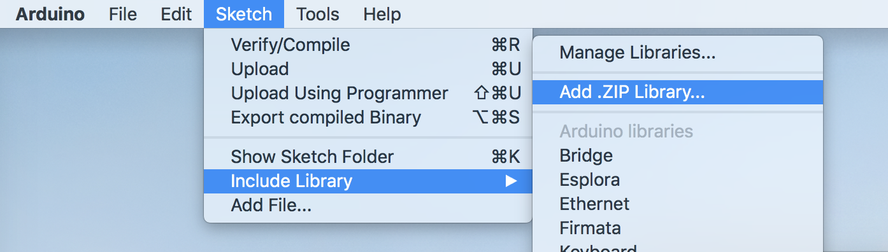
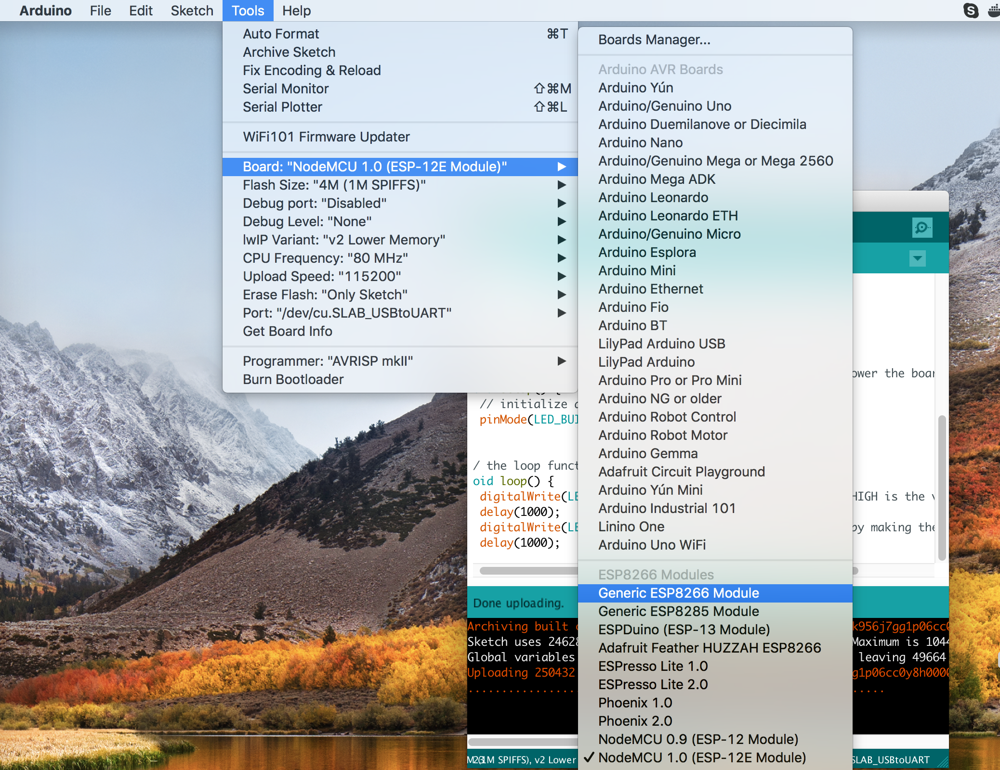
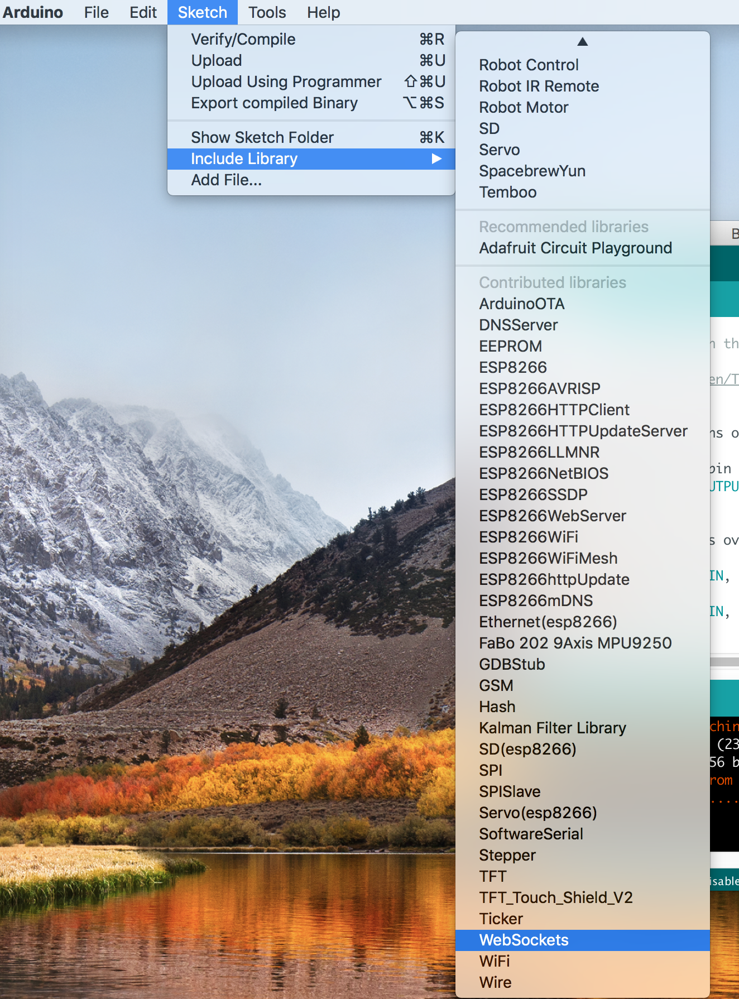

# Hackathon Essentials Cookbook
Try to follow the recipe decribed in this cookbook to set up your developer environment if you are interested to hack during the session. If you run into some trouble, use Google first. If that fails, open an issue here, and we can try to resolve it together. :) 

## Android Studio
1. Install the latest Android Studio for your OS from https://developer.android.com/studio/ 

1. Open Android Studio IDE, start a new Blank Project. Then go to **Tools -> SDK Manager**

1. If you have an Android Phone, note the version of the Android OS installed on your phone. In the **SDK Platforms tab**, download Platform for **Android P Preview** and for the **version of Android OS installed on your phone**.
    p.s. If you do not have an Android Phone, you can work with a friend who has it. Hackathons are about team work after all!

    

1. Head over to the **SDK Tools tab** and ensure that SDK Tools ver 26.1.1 is installed. If not, install them.
    

## Driver for the Android Device

1. If you want to use your android device during the session, you **might** have to install drivers to allow your computer's OS to install and debug your device directly.

1. First things first, enable 'Developer Mode' on your Android Device. For most devices, you can head to Settings -> About Phone and then tap Build Number list item multiple times. Use Google to find out how to enable developer mode on your device.

1. Before we try to find and install the correct driver for your device on the PC, let's check whether your OS (mostly Linux/Mac) support it out of the box.
    1. Connect your device via the USB cable to your PC.
    1. Click the run button (green play button) next to your project name in the toolbox ribbon located at the top right hand side of the IDE.
    
    1. If you see your device in the list of connected devices, you are good to go and can move on to the next section.
    
    1. So, I assume if you are readind this, you do not see your device in the 'Select Deployment Target' dialog. Well, Try to search Google for "{Your device's Manufacturer/Model} " + "driver" +  "{OS installed on your PC}". If everything fails, open an issue in this repository and we can try to investigate a bit further.

1. All set!! \m/

## Arduino and Esp8266
To make IoT happen, we need to program a WiFi enabled microcontroller, namely, ESP8266. To do so, we use the Arduino IDE and download the board configurations for the ESP8266 family of WiFi enabled microcontrollers. Below are the steps to set up your dev environment for basic IoT applications using ESP8266

1. Install Arduino IDE from here: https://www.arduino.cc/en/Main/Software. For Windows 10, use the Microsoft Store to install it as an App.

1. Open the Arduino IDE and use the Board Manager to install 'Arduino Core for ESP8266 WiFi Chip' as desribed here: https://github.com/esp8266/Arduino#installing-with-boards-manager 

1. [Click this link](https://github.com/Links2004/arduinoWebSockets/archive/master.zip) to download the WebSockets library we will use to communicate with the Android App.

1. In the Arduino IDE, select Sketch -> Include Library -> Add .ZIP Library
    
1. Then browse to and select the arduinoWebSockets.zip you downloaded in Step 3 to make this library visible to the Arduino Compiler.

1. If all went well, you should be able to see 
    1. ESP8266 boards listed in Tools -> Board menu
        
    1. WebSockets in the Sketch -> Include Library menu 
        

1. Lastly, we need to install a driver to interface the USBToUART bridge on the ESP8266 module (NodeMCU from our pals in China) with your computer. You can get the driver from [here](https://www.silabs.com/products/development-tools/software/usb-to-uart-bridge-vcp-drivers)

Voila! All set to hack \m/